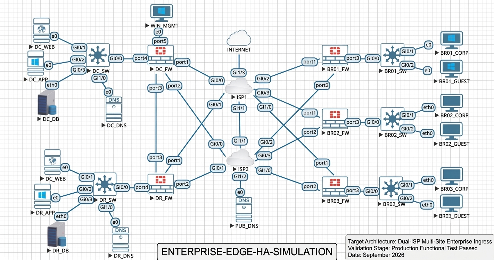

# Enterprise Network Simulation: Multi-Branch Infrastructure inside EVE-NG

## 📌 Project Overview
This repository contains configuration files and topology details for a comprehensive multi-site enterprise network simulated within the **EVE-NG Emulation Platform**, featuring dual-homed provider fabrics (`ISP1` and `ISP2`), a Corporate Data Center, a Disaster Recovery site, and three remote branch offices.

*For the complete detailed README specification including asset structures, EVE-NG setups, and verification testing, please refer to the full document in the source.*

---

## 👤 Project Engineering
* **Designed, Configured, and Validated by:** Zaki Shaikh

---

## 🗺️ Logical Infrastructure Topology

---

## 🛠️ Core Engineering Specifications

### 1. Border Transport & High Availability
* **Dual-Homed Provider Transit:** Implements simultaneous ingress/egress transport lines through redundant upstream providers (**ISP1** and **ISP2**) utilizing weighted deterministic static route boundaries to manage automatic link state failure conditions.
* **Core Resilience Optimization:** Integrates high-performance Next-Generation Firewall platforms at the edges to continuously track transport viability and handle real-time session redistribution.
* **Isolated Service Spaces:** Deployed distinct internal DNS zones (`DC_DNS`, `DR_DNS`) running completely segregated from root public resolution systems (`PUB_DNS`) to isolate corporate Active Directory and internal asset namespaces.

### 2. Micro-Segmentation & Boundary Defense
* **Next-Generation Firewall (NGFW) Perimeter Control:** Multi-interface firewall environments isolate and secure all ingress/egress transitions between local switching fabrics and provider domains.
* **Endpoint Isolation Profile:** Internal enterprise users (`BR01_CORP`) share physical local switches with unauthenticated guest users (`BR01_GUEST`) but are completely isolated at Layer 3 using explicit VLAN tagging and strict interface zoning access control lists.
* **DMZ Protection Controls:** High-value application infrastructure blocks (`DC_WEB`, `DC_APP`) run within isolated Demilitarized Zones, enforcing restrictive ingress filtering that drops all transactional traffic outside of whitelisted web transport layers.

---

## 📁 Repository Directory Structure & Assets
* `/topology`: Contains the updated high-resolution logical network blueprint used to drive environment provisioning.
* `/configs`: Holds clean, device-specific terminal outputs extracted directly post-validation:
  * `DC_Infrastructure.txt` - Datacenter Core Firewall (FortiOS) security mappings and Layer 3 Core Switch configurations.
  * `DR_Infrastructure.txt` - Disaster Recovery edge context parameters and target server distribution parameters.
  * `BR01_Office.txt` - Remote branch access control boundaries and user VLAN distributions.
  * `ISP1_Core.txt` - Provider transit interfaces modeling external service delivery.
  * `IP_Addressing_Map.md` - Structured schema tracking host interfaces and engineering subnets across the enterprise.

---

## 🧪 Functional Verification Cycles
The following operational verification routines were carried out directly on the active data plane to validate configuration execution:
1. **End-to-End Enterprise Ingress:** Confirmed deterministic reachability from an isolated remote workstation (`BR01_CORP`) to backend transaction storage nodes (`DC_DB`) via complete hop-by-hop traceroute analytics.
2. **Deterministic Edge Convergence Failover:** Manually brought down the primary link via `ISP1`. The edge gateway instantly re-routed all corporate internal and server transit mechanisms over the backup `ISP2` transport fabric within `< 3 seconds`, preventing any application timeout states.
3. **Security Ingress Drop Verification:** Simulated public untrusted probes targeting private application tiers; perimeter security rulesets successfully caught, logged, and dropped all non-whitelisted ingress parameters.

---

## 👤 Project Engineering
* **Designed, Configured, and Validated by:** [Zaki Shaikh]
* **Professional Network Profile:** [https://www.linkedin.com/in/zaki-s-a96476129/]
